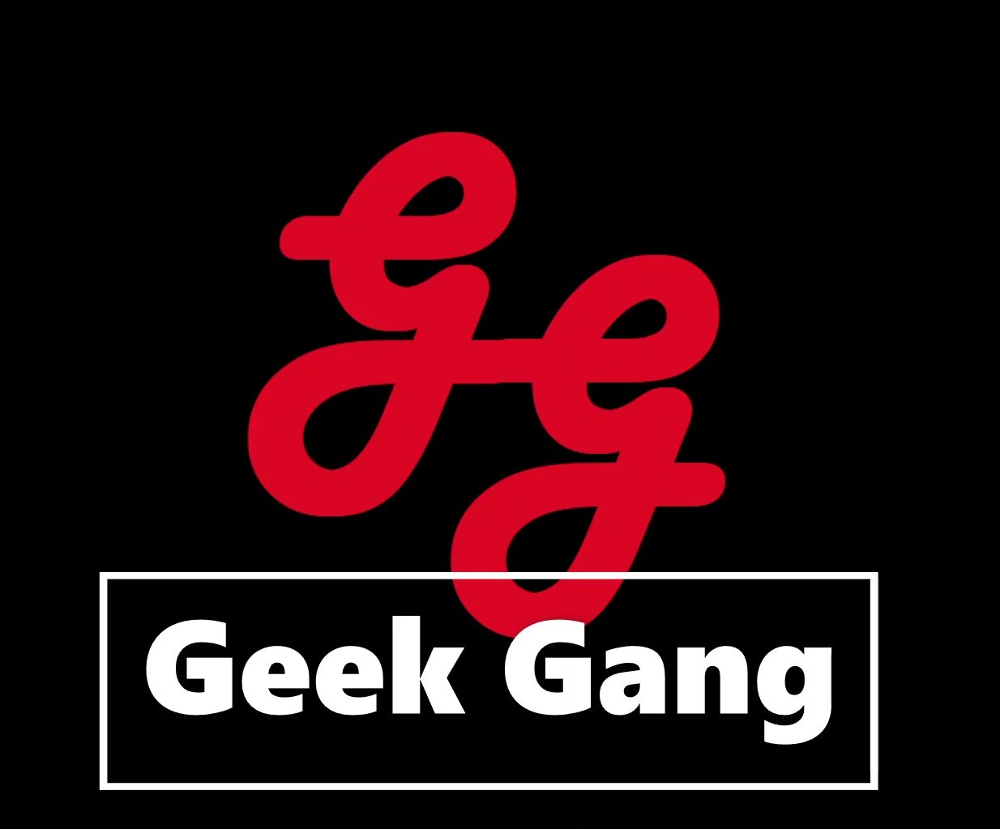
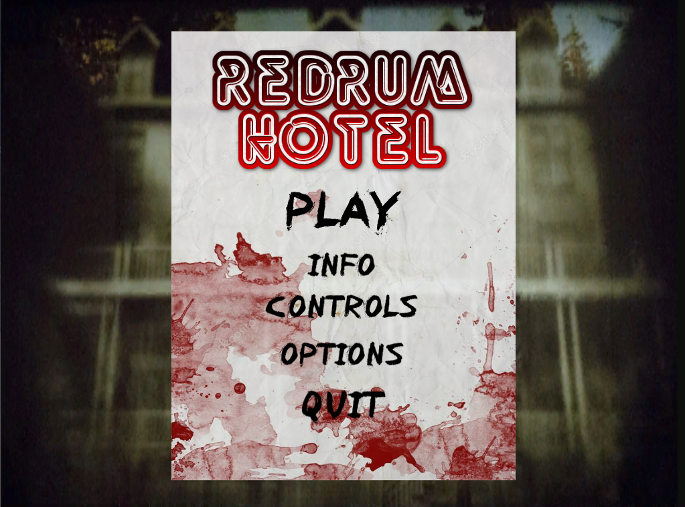
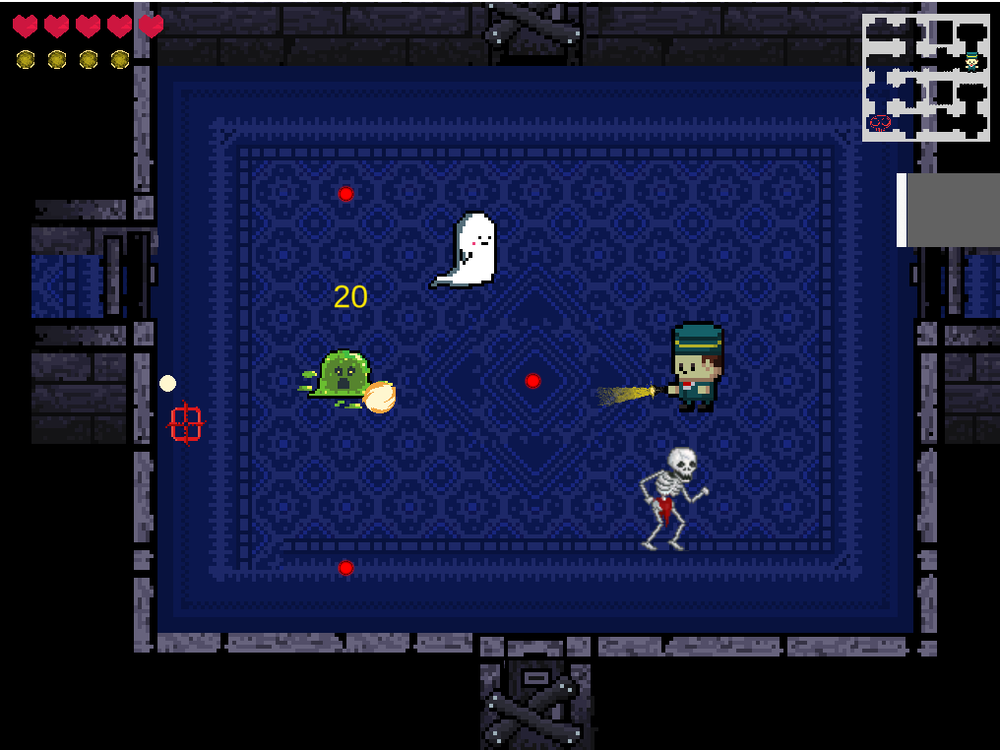
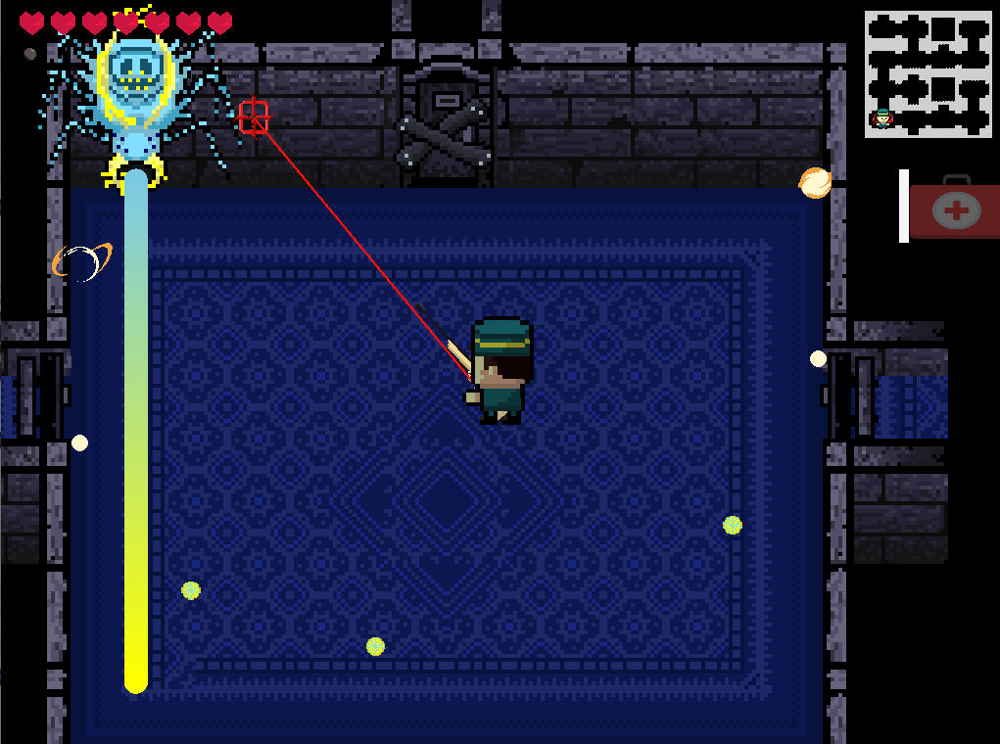
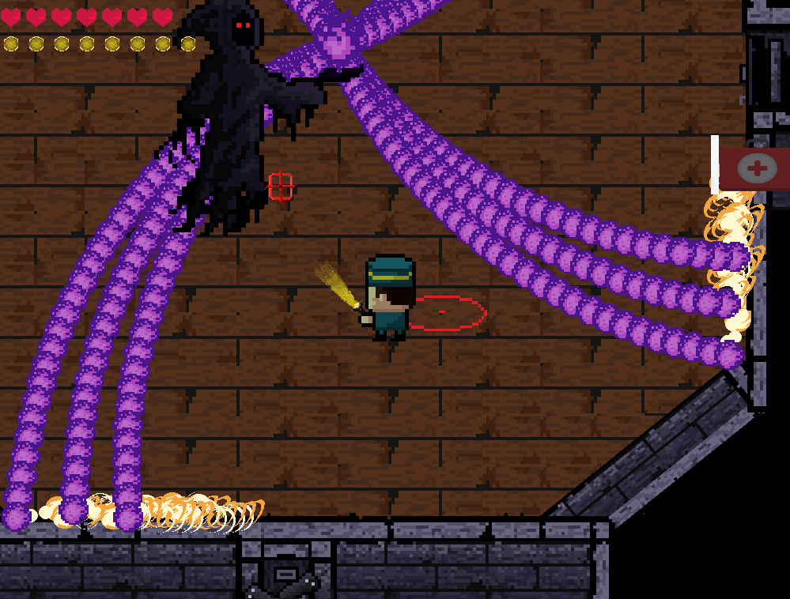

### Development Staff
[Jayden Stipek](https://www.linkedin.com/in/jayden-stipek-aa5460165/)  
[Jeffrey Murray Jr](https://www.linkedin.com/in/jeffmurjr/)  
[Christopher O'Keefe](https://www.linkedin.com/in/chris-o-keefe-a9bba9b7/)  
[Andy Tran](https://www.linkedin.com/in/andy-tran-8968b0170/)  
[Cole Liu](https://www.linkedin.com/in/colezhichen/)  

## ABOUT THIS GAME
When Casper begins an ordinary day as a bellhop, he finds himself trapped on the top floor of Hotel RedRum, and must find a way out.
# The only way out is down
<iframe width="500" height="315" src="https://www.youtube-nocookie.com/embed/IxQwqimojLA" frameborder="0" allow="accelerometer; autoplay; encrypted-media; gyroscope; picture-in-picture" allowfullscreen></iframe>

### Gameplay
Hotel RedRum is a randomly generated action RPG shooter with heavy Rogue-like elements. An interesting mix of [The Binding of Issac](https://store.steampowered.com/app/250900/The_Binding_of_Isaac_Rebirth/) and [Enter the Gungeon](https://store.steampowered.com/app/311690/Enter_the_Gungeon/), where on his journey players will find bizarre items, weapons, and enemies that will determine if he will survive. 
###### Keep in mind this game is currently under development with new features on the way.

### What is Hotel RedRum
'RedRum' obviously coined from the 1980's hit Film _The Shining_ allowed our development team to focus on a theme that would warn players of a treacherous and unforgiving path ahead, however the gameplay shows a friendly main character _Casper_ and child friendly enemies. 

### [Current Features](./gdd.html)
- Main Menu with volume control and information about items
- Player Statistics
- Random Map Generation (4x4, 5x5, 6x6)
- Cache System to save items in room.
- Active and Passive Items
- Weapons:
  - Flashlight (Starting)
  - Raygun
  - Sniper Rifle
  - Shotgun



<a href="{{ site.github.repository_url }}">{{ site.github.repository_name }}</a> is maintained by <a href="{{ site.github.owner_url }}">{{ site.github.owner_name }}</a>.



This page was generated by <a href="https://pages.github.com">GitHub Pages</a>.

